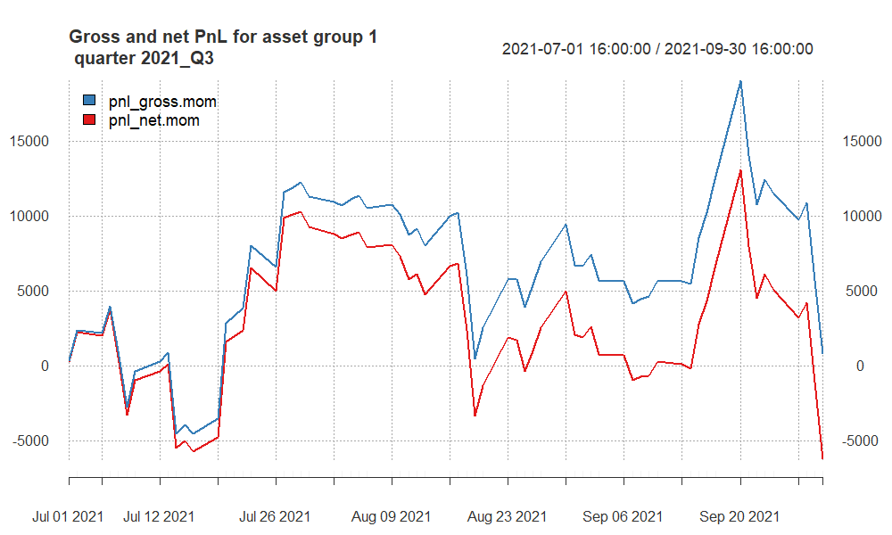

# Introduction

I analyzed data for different quarters using a Momentum trading strategy. The strategy involves calculating various indicators, such as EMA50 - EMA180, and EMA 50 - EMA200 and making trading decisions based on the relative positions of these indicators.


I obtained these EMA based on that Grid Search I applied to get the best results.


```{r setup, include=FALSE}
library(xts)
library(chron)
library(TTR)
library(tseries)
library(knitr)
library(kableExtra)
library(quantmod)
library(caTools)
library(lubridate)
library(scales)
library(ggplot2)
library(RColorBrewer)
library(grDevices)
library(lattice)
library(dplyr)
source("https://raw.githubusercontent.com/ptwojcik/HFD/master/function_mySR.R")
source("https://raw.githubusercontent.com/ptwojcik/HFD/master/functions_plotHeatmap.R")
source("https://raw.githubusercontent.com/ptwojcik/HFD/master/function_positionVB_new.R")
```

```{r}
CalmRatio <- function(x, # x = series of returns
                          # scale parameter = Nt
                          scale) {
  scale * mean(coredata(x), na.rm = TRUE) / 
    maxdrawdown(cumsum(x))$maxdrawdown
}
Sys.setenv(TZ = 'America/New_York')
```

```{r}
mySR <- function(x, scale) {
  sqrt(scale) * mean(coredata(x), na.rm = TRUE) / 
    sd(coredata(x), na.rm = TRUE)
} 
```


```{r}
### Main Looop
for (selected_quarter in c("2021_Q1", "2021_Q3", "2021_Q4", 
                           "2022_Q2", "2022_Q4", 
                           "2023_Q1", "2023_Q2")) {
  
  message(selected_quarter)
  data_folder <- "data/"
  #loading the subdata
  filename_ <- paste0(data_folder, "data1_", selected_quarter, ".RData")
  load(filename_)
  
  #indexing
  data.group1 <- get(paste0("data1_", selected_quarter))
  
  times_ <- substr(index(data.group1), 12, 19)
  
  
  # 1.	do not use in calculations the data from the first 
  # and last 10 minutes of the session (9:31--9:40 and 15:51--16:00)
  # – put missing values there,
  
  # missing
  data.group1["T09:31/T09:40",] <- NA 
  data.group1["T15:51/T16:00",] <-NA
  
  # lets calculate EMA50 and EMA200 for NQ
  data.group1$NQ_EMA9 <- EMA(na.locf(data.group1$NQ), 50) #Golden Cross
  data.group1$NQ_EMA200 <- EMA(na.locf(data.group1$NQ), 180)  #Death Cross
  
  # and EMA50 and EMA200 for SP
  data.group1$SP_EMA9 <- EMA(na.locf(data.group1$SP), 50)
  data.group1$SP_EMA200 <- EMA(na.locf(data.group1$SP), 200)
  
  
  data.group1$NQ_EMA9[is.na(data.group1$NQ)] <- NA
  data.group1$NQ_EMA200[is.na(data.group1$NQ)] <- NA
  data.group1$SP_EMA9[is.na(data.group1$SP)] <- NA
  data.group1$SP_EMA200[is.na(data.group1$SP)] <- NA
  
  
  # lets calculate the position for the MOMENTUM strategy
  # if fast MA(t-1) > slow MA(t-1) => pos(t) = 1 [long]
  # if fast MA(t-1) <= slow MA(t-1) => pos(t) = -1 [short]
  data.group1$positionNQ.mom <- ifelse(lag.xts(data.group1$NQ_EMA9) >
                                         lag.xts(data.group1$NQ_EMA200),
                                       1, -1)
  
  data.group1$positionSP.mom <- ifelse(lag.xts(data.group1$SP_EMA9) >
                                         lag.xts(data.group1$SP_EMA200),
                                       1, -1)
  
  # - exit all positions 20 minutes before the session end, i.e. at 15:40
  # - do not trade within the first 25 minutes of stocks quotations (until 09:55)
  data.group1$positionSP.mom[times(times_) <= times("09:55:00") | 
                               times(times_) > times("15:40:00")] <- 0
  
  data.group1$positionNQ.mom[times(times_) <= times("09:55:00") | 
                               times(times_) > times("15:40:00")] <- 0
  
  
  # lets also fill every missing position with the previous one
  data.group1$positionSP.mom <- na.locf(data.group1$positionSP.mom, na.rm = FALSE)
  data.group1$positionNQ.mom <- na.locf(data.group1$positionNQ.mom, na.rm = FALSE)
  
  # calculating gross pnl
  data.group1$pnl_grossNQ.mom <- data.group1$positionNQ.mom * diff.xts(data.group1$NQ) * 20
  data.group1$pnl_grossSP.mom <- data.group1$positionSP.mom * diff.xts(data.group1$SP) * 50
  
  
  # number of transactions
  data.group1$ntransSP.mom <- abs(diff.xts(data.group1$positionSP.mom))
  data.group1$ntransNQ.mom <- abs(diff.xts(data.group1$positionNQ.mom))
  
  data.group1$ntransSP.mom[1] <- 0
  data.group1$ntransNQ.mom[1] <- 0
  
  # net pnl
  data.group1$pnl_netNQ.mom <- data.group1$pnl_grossNQ.mom  -
    data.group1$ntransNQ.mom * 10 # 10$ per transaction
  
  data.group1$pnl_netSP.mom <- data.group1$pnl_grossSP.mom  -
    data.group1$ntransSP.mom * 10 # 10$ per transaction
  
  # total for strategy
  data.group1$pnl_gross.mom <- data.group1$pnl_grossNQ.mom + data.group1$pnl_grossSP.mom
  data.group1$pnl_net.mom <- data.group1$pnl_netNQ.mom + data.group1$pnl_netSP.mom
  
  
  # aggregate pnls and number of transactions to daily
  my.endpoints <- endpoints(data.group1, "days")
  
  data.group1.daily <- period.apply(data.group1[,c(grep("pnl", names(data.group1)),
                                                   grep("ntrans", names(data.group1)))],
                                    INDEX = my.endpoints, 
                                    FUN = function(x) colSums(x, na.rm = TRUE))
  
  # summarize the strategy for this quarter
  # SR
  grossSR = mySR(x = data.group1.daily$pnl_gross.mom, scale = 252)
  netSR = mySR(x = data.group1.daily$pnl_net.mom, scale = 252)
  # CR
  grossCR = CalmRatio(x = data.group1.daily$pnl_gross.mom, scale = 252)
  netCR = CalmRatio(x = data.group1.daily$pnl_net.mom, scale = 252)
  
  # average number of transactions
  av.daily.ntrades = mean(data.group1.daily$ntransSP.mom + 
                            data.group1.daily$ntransNQ.mom, na.rm = TRUE)
  # PnL
  grossPnL = sum(data.group1.daily$pnl_gross.mom)
  netPnL = sum(data.group1.daily$pnl_net.mom)
  # stat
  stat = netCR * max(0, log(abs(netPnL/1000)))
  
  # collecting all statistics for a particular quarter
  quarter_stats <- data.frame(quarter = selected_quarter,
                              grossSR,
                              netSR,
                              grossCR,
                              netCR,
                              av.daily.ntrades,
                              grossPnL,
                              netPnL,
                              stat,
                              stringsAsFactors = FALSE
  )
  cat("Net Profit for", selected_quarter, ":", netPnL, "\n")
  
  # collect summaries
  if(!exists("quarter_stats.all.group1")) quarter_stats.all.group1 <- quarter_stats else
    quarter_stats.all.group1 <- rbind(quarter_stats.all.group1, quarter_stats)
  
  # create a plot of gros and net pnl and save it to png file. My R studio right-pane doesn't work. so i save
  png(filename = paste0("pnl_group1_", selected_quarter, ".png"),
      width = 1000, height = 600)
  
  print( # when plotting in a loop you have to use print()
    plot(cbind(cumsum(data.group1.daily$pnl_gross.mom),
               cumsum(data.group1.daily$pnl_net.mom)),
         multi.panel = FALSE,
         main = paste0("Gross and net PnL for asset group 1 \n quarter ", selected_quarter), 
         col = c("#377EB8", "#E41A1C"),
         major.ticks = "weeks", 
         grid.ticks.on = "weeks",
         grid.ticks.lty = 3,
         legend.loc = "topleft",
         cex = 1)
  )
  #
  dev.off()
  
  # unneccesary
  rm(data.group1, my.endpoints, grossSR, netSR, av.daily.ntrades,
     grossPnL, netPnL, stat, quarter_stats, data.group1.daily)
  
  gc()
} 

```

```{r}
#saving
write.csv(quarter_stats.all.group1, 
          "statisticsforG1.csv",
          row.names = FALSE)
```

## PnL of results for **group 1** -- quarter 2021Q1

```{r, echo = F, out.width ='100%'}


```


## PnL of results for **group 2** -- quarter 2021Q3

```{r, echo = F, out.width ='100%'}


```


## PnL of results for **group 2** -- quarter 2021Q4

```{r, echo = F, out.width ='100%'}


```

## PnL of results for **group 2** -- quarter 2022Q2

```{r, echo = F, out.width ='100%'}


```

## PnL of results for **group 2** -- quarter 2022Q4

```{r, echo = F, out.width ='100%'}


```

## PnL of results for **group 2** -- quarter 2023Q1

```{r, echo = F, out.width ='100%'}
knitr::include_graphics("pnl_group1_2023_Q1.png")

```

## PnL of results for **group 2** -- quarter 2023Q2

```{r, echo = F, out.width ='100%'}


```

```{r}
data <- read.csv("statisticsforG1.csv")
head(data)
```


