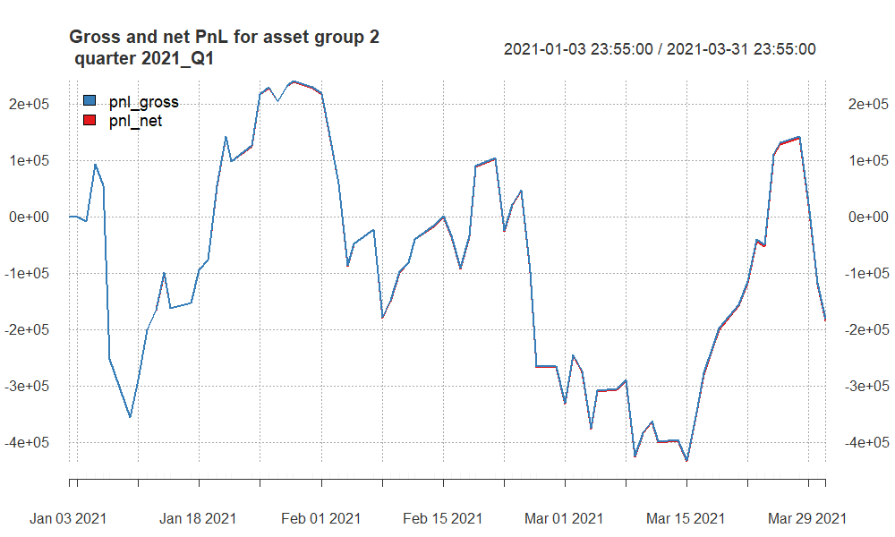
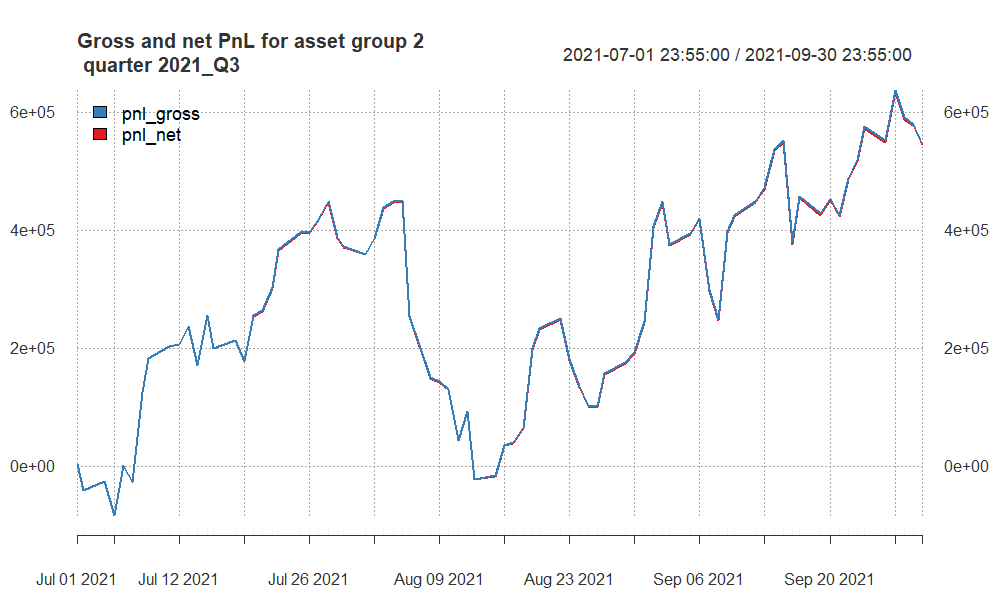
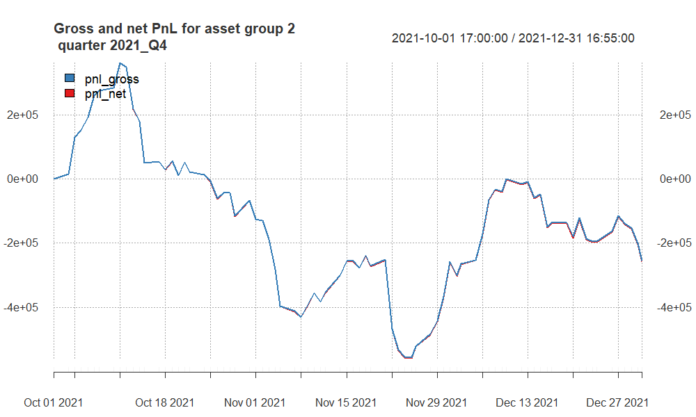
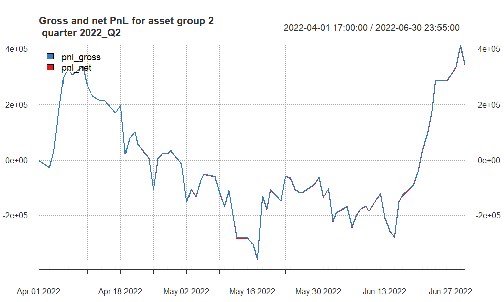
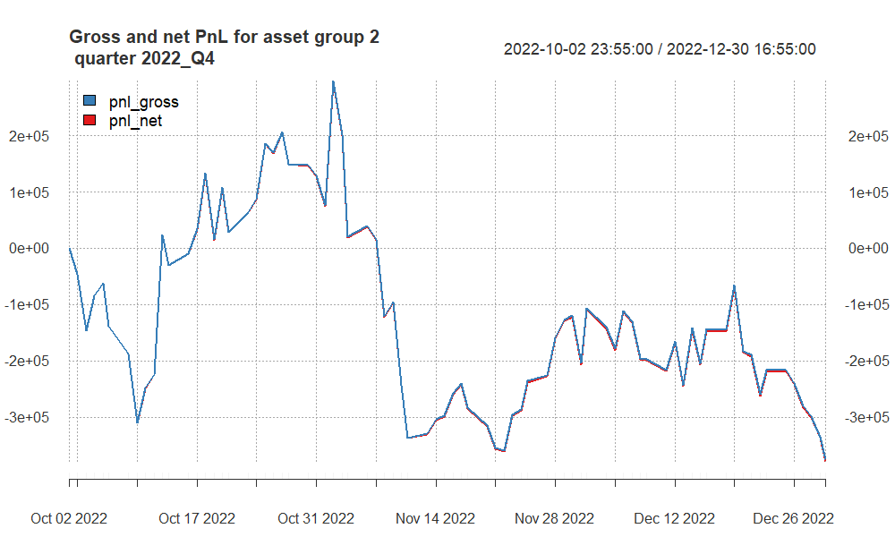
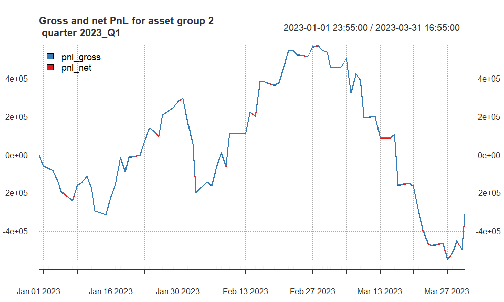
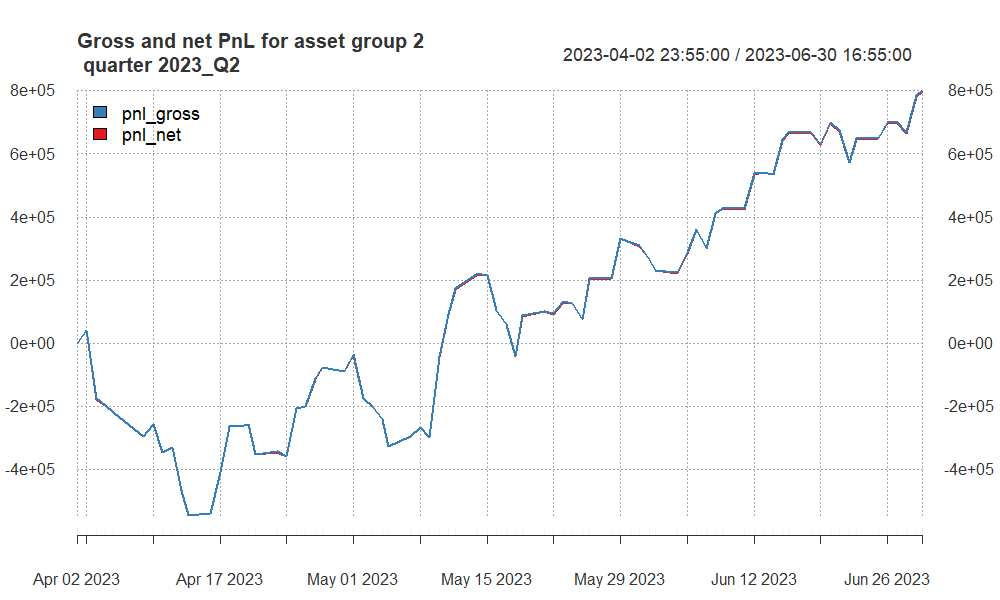

***Introduction***
We implement a mean-reverting techniques on CAD and XAU. Strategy involves the calculation of short-term EMAs, medium-term SMAs, and long-term EMAs, also volatility measures. Positions are then determined based on deviations from these indicators. Analysis aims to identify optimal trading periods and assess the strategy's risk-adjusted returns over time. 

The parameters were also derived from GridSearch, to get best result based on CR and SR.


```{r}
library(xts)
library(chron)
library(TTR)
library(tseries)
library(knitr) # for nicely looking tables in html files
library(kableExtra) # for even more nicely looking tables in html files
library(quantmod) # for PnL graphs
library(caTools)
library(lubridate)
library(scales)
library(ggplot2)
library(RColorBrewer)
library(dplyr) # for if_else()
library(lattice) # for levelplot()
library(grDevices)
# install.packages("dplyr")
# install.packages("lattice")
# install.packages("grDevices") # for colorRampPalette


source("https://raw.githubusercontent.com/ptwojcik/HFD/master/function_mySR.R")
source("https://raw.githubusercontent.com/ptwojcik/HFD/master/functions_plotHeatmap.R")
source("https://raw.githubusercontent.com/ptwojcik/HFD/master/function_positionVB_new.R")
```

```{r}
CalmrRatio <- function(x, # x = series of returns
                          # scale parameter = Nt
                          scale) {
  scale * mean(coredata(x), na.rm = TRUE) / 
    maxdrawdown(cumsum(x))$maxdrawdown
}

Sys.setenv(TZ = 'America/New_York')
```

```{r}
mySR <- function(x, scale) {
  sqrt(scale) * mean(coredata(x), na.rm = TRUE) / 
    sd(coredata(x), na.rm = TRUE)
}
```


```{r}
#main looop

for (selected_quarter in c("2021_Q1", "2021_Q3", "2021_Q4", 
                           "2022_Q2", "2022_Q4", 
                           "2023_Q1", "2023_Q2")) {
  
  message(selected_quarter)
  data_folder <- "data/"
  # loading the subdata
  filename_ <- paste0(data_folder, "data2_", selected_quarter, ".RData")
  load(filename_)
  data.group2 <- get(paste0("data2_", selected_quarter))
  
  
  # filling 0s
  data.group2$pos_flat <- xts(rep(0, nrow(data.group2)), 
                              index(data.group2))
  
  # no trades 18:00-18:10 and 16:51-17:00
  
  data.group2$pos_flat["T16:50/T18:10"] <- 1
  
  # Short-term EMAs
  data.group2$CAD_signalEMA.values <- EMA(na.locf(data.group2$CAD, na.rm = FALSE), 9)
  data.group2$XAU_signalEMA.values <- EMA(na.locf(data.group2$XAU, na.rm = FALSE), 10)
  
  # Medium-term SMAs
  data.group2$CAD_mediumSMA.values <- SMA(na.locf(data.group2$CAD, na.rm = FALSE), 50)
  data.group2$XAU_mediumSMA.values <- SMA(na.locf(data.group2$XAU, na.rm = FALSE), 50)
  
  # Long-term EMAs
  data.group2$CAD_slowEMA.values <- EMA(na.locf(data.group2$CAD, na.rm = FALSE), 100)
  data.group2$XAU_slowEMA.values <- EMA(na.locf(data.group2$XAU, na.rm = FALSE), 200)
  
  # Volatility calculation
  data.group2$CAD_volat.sd.values <- runsd(na.locf(data.group2$CAD, na.rm = FALSE), 90, 
                                           endrule = "NA", 
                                           align = "right")
  data.group2$XAU_volat.sd.values <- runsd(na.locf(data.group2$XAU, na.rm = FALSE), 120, 
                                           endrule = "NA", 
                                           align = "right")
  
  # Handling missing values
  data.group2$CAD_signalEMA.values[is.na(data.group2$CAD)] <- NA
  data.group2$XAU_signalEMA.values[is.na(data.group2$XAU)] <- NA
  data.group2$CAD_mediumSMA.values[is.na(data.group2$CAD)] <- NA
  data.group2$XAU_mediumSMA.values[is.na(data.group2$XAU)] <- NA
  data.group2$CAD_slowEMA.values[is.na(data.group2$CAD)] <- NA
  data.group2$XAU_slowEMA.values[is.na(data.group2$XAU)] <- NA
  data.group2$CAD_volat.sd.values[is.na(data.group2$CAD)] <- NA
  data.group2$XAU_volat.sd.values[is.na(data.group2$XAU)] <- NA
  
  # Position calculation for mean-reverting strategy
  data.group2$CAD_pos <- positionVB_new(signal = data.group2$CAD_signalEMA.values,
                                        lower = data.group2$CAD_slowEMA.values - 2 * data.group2$CAD_volat.sd.values,
                                        upper = data.group2$CAD_slowEMA.values + 2 * data.group2$CAD_volat.sd.values,
                                        pos_flat = coredata(data.group2$pos_flat),
                                        strategy = "mr")
  
  data.group2$XAU_pos <- positionVB_new(signal = data.group2$XAU_signalEMA.values,
                                        lower = data.group2$XAU_slowEMA.values - 1 * data.group2$XAU_volat.sd.values,
                                        upper = data.group2$XAU_slowEMA.values + 1 * data.group2$XAU_volat.sd.values,
                                        pos_flat = coredata(data.group2$pos_flat),
                                        strategy = "mr")

  
  # calculating gross pnl
  
  data.group2$pnl_gross.CAD <- ifelse(is.na(data.group2$CAD_pos * diff.xts(data.group2$CAD)),
                                      0, data.group2$CAD_pos * diff.xts(data.group2$CAD) * 100000
  )
  
  data.group2$pnl_gross.XAU <- ifelse(is.na(data.group2$XAU_pos * diff.xts(data.group2$XAU)),
                                      0, data.group2$XAU_pos * diff.xts(data.group2$XAU) * 5000
  )
  
  
  # nr of transactions 
  data.group2$ntrans.CAD <- abs(diff.xts(data.group2$CAD_pos))
  data.group2$ntrans.CAD[is.na(data.group2$ntrans.CAD)] <- 0
  
  data.group2$ntrans.XAU <- abs(diff.xts(data.group2$XAU_pos))
  data.group2$ntrans.XAU[is.na(data.group2$ntrans.XAU)] <- 0
  
  # net pnl
  data.group2$pnl_net.CAD <- data.group2$pnl_gross.CAD - data.group2$ntrans.CAD * 7 # 7$ transaction cost
  data.group2$pnl_net.XAU <- data.group2$pnl_gross.XAU - data.group2$ntrans.XAU * 7 # same
  
  # aggregate to daily
  my.endpoints <- endpoints(data.group2, "days")
  data.group2.daily <- period.apply(data.group2[,c(grep("pnl", names(data.group2)),
                                                   grep("ntrans", names(data.group2)))],
                                    INDEX = my.endpoints, 
                                    FUN = function(x) colSums(x, na.rm = TRUE))
  
  # sum gross and net daily pnl
  data.group2.daily$pnl_gross <- 
    data.group2.daily$pnl_gross.CAD + data.group2.daily$pnl_gross.XAU
  
  
  data.group2.daily$pnl_net <- 
    data.group2.daily$pnl_net.CAD +
    data.group2.daily$pnl_net.XAU
  
  # sum num of transactions
  
  data.group2.daily$ntrans <- 
    data.group2.daily$ntrans.CAD +
    data.group2.daily$ntrans.XAU
  
  # SR
  grossSR = mySR(x = data.group2.daily$pnl_gross, scale = 252)
  netSR = mySR(x = data.group2.daily$pnl_net, scale = 252)
  # CR
  grossCR = CalmrRatio(x = data.group2.daily$pnl_gross, scale = 252)
  netCR = CalmrRatio(x = data.group2.daily$pnl_net, scale = 252)
  
  # average number of transactions
  av.daily.ntrades = mean(data.group2.daily$ntrans, 
                          na.rm = TRUE)
  # PnL
  grossPnL = sum(data.group2.daily$pnl_gross)
  netPnL = sum(data.group2.daily$pnl_net)
  
  # stat
  stat = netCR * max(0, log(abs(netPnL/1000)))
  
  # collecting all statistics for a particular quarter
  quarter_stats <- data.frame(quarter = selected_quarter,
                              assets.group = 2,
                              grossSR,
                              netSR,
                              grossCR,
                              netCR,
                              av.daily.ntrades,
                              grossPnL,
                              netPnL,
                              stat,
                              stringsAsFactors = FALSE
  )
  cat("Net Profit for", selected_quarter, ":", netPnL, "\n")
  # collect summaries for all quarters
  if(!exists("quarter_stats.all.group2")) quarter_stats.all.group2 <- quarter_stats else
    quarter_stats.all.group2 <- rbind(quarter_stats.all.group2, quarter_stats)
  
  # create plot and save as png. Rstudio is broken
  
  png(filename = paste0("pnl_group2_", selected_quarter, ".png"),
      width = 1000, height = 600)
  print( # when plotting in a loop you have to use print()
    plot(cbind(cumsum(data.group2.daily$pnl_gross),
               cumsum(data.group2.daily$pnl_net)),
         multi.panel = FALSE,
         main = paste0("Gross and net PnL for asset group 2 \n quarter ", selected_quarter), 
         col = c("#377EB8", "#E41A1C"),
         major.ticks = "weeks", 
         grid.ticks.on = "weeks",
         grid.ticks.lty = 3,
         legend.loc = "topleft",
         cex = 1)
  )
  dev.off()
  
  # remove all unneeded objects for group 2
  rm(data.group2, my.endpoints, grossSR, netSR, av.daily.ntrades,
     grossPnL, netPnL, stat, quarter_stats, data.group2.daily)
  
  gc()
  
  
}
#end
```

```{r}
#saving
write.csv(quarter_stats.all.group2, 
          "statisticsforG2.csv",
          row.names = FALSE)
```

## PnL of results for **group 1** -- quarter 2021Q1

```{r, echo = F, out.width ='100%'}


```


## PnL of results for **group 2** -- quarter 2021Q3

```{r, echo = F, out.width ='100%'}


```


## PnL of results for **group 2** -- quarter 2021Q4

```{r, echo = F, out.width ='100%'}


```

## PnL of results for **group 2** -- quarter 2022Q2

```{r, echo = F, out.width ='100%'}


```

## PnL of results for **group 2** -- quarter 2022Q4

```{r, echo = F, out.width ='100%'}


```

## PnL of results for **group 2** -- quarter 2023Q1

```{r, echo = F, out.width ='100%'}


```

## PnL of results for **group 2** -- quarter 2023Q2

```{r, echo = F, out.width ='100%'}


```

```{r}
data <- read.csv("statisticsforG2.csv")
head(data)
```


Based on the provided data for the second assets group, let's rank the quarters based on net profit, net Sharpe Ratio (SR), and net Calmar Ratio (CR) to identify the best three quarters:

Net Profit:
Q2 2022: $345,907.0
Q3 2021: $546,483.3
Q1 2021: -$181,454.0 (Note: Negative net profit)
Net Sharpe Ratio (SR):
Q3 2021: 1.70
Q2 2022: 1.04
Q1 2021: -0.48 (Note: Negative net SR)
Net Calmar Ratio (CR):
Q3 2021: 3.66
Q2 2022: 1.60
Q1 2021: -0.91 (Note: Negative net CR)


***Conclusion:***
Q3 2021: This quarter stands out as the best across all three metrics - highest net profit, net Sharpe Ratio, and net Calmar Ratio. It demonstrates robust positive performance with good risk-adjusted returns.

Q2 2022: While not as strong as Q3 2021, Q2 2022 performs well, especially in terms of net profit and net Sharpe Ratio. It is the second-best quarter based on these metrics.

Q1 2021: Despite having a negative net profit and negative net Sharpe Ratio, it is included in the top three due to its relatively better net Calmar Ratio compared to other quarters.

It's important to note that negative values for net profit, net SR, and net CR in Q1 2021 indicate challenges in generating positive returns and managing risk during that quarter. Consider further analysis to understand the factors contributing to negative performance and explore potential improvements for future strategies.